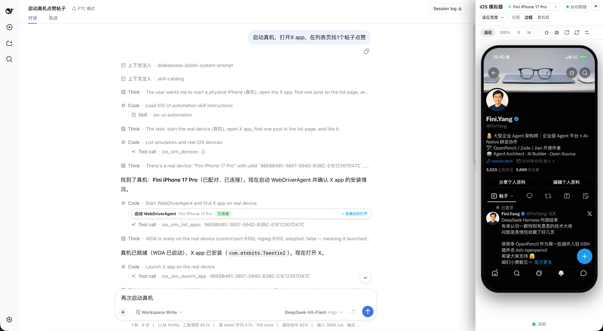

<p align="center">
  
</p>

<h1 align="center">DSH Simulador de iOS</h1>

<p align="center">
  <strong>Un simulador de iOS en vivo e interactivo dentro de una conversación de <a href="https://github.com/deepseek-ai/deepseek-harness">DeepSeek Harness</a>, más tu iPhone real por USB.</strong><br />
  <sub>22 herramientas del agente &bull; panel lateral MJPEG en vivo &bull; simulador &amp; iPhone real por USB &bull; acciones sobre filas de listas/feeds &bull; recarga en caliente de vistas previas SwiftUI</sub>
</p>

<p align="center">
  <sub>npm: <code>@zseven-w/dsh-ios</code> &middot; Versión actual del plugin: <code>0.1.0-rc.3</code> &middot; Probado con DSH <code>0.1.1-rc.1</code></sub>
</p>

<p align="center">
  <a href="./README.md">English</a> &middot; <a href="./README.zh.md">简体中文</a> &middot; <a href="./README.zh-TW.md">繁體中文</a> &middot; <a href="./README.ja.md">日本語</a> &middot; <a href="./README.ko.md">한국어</a> &middot; <a href="./README.fr.md">Français</a> &middot; <b>Español</b> &middot; <a href="./README.de.md">Deutsch</a> &middot; <a href="./README.pt.md">Português</a> &middot; <a href="./README.ru.md">Русский</a> &middot; <a href="./README.hi.md">हिन्दी</a> &middot; <a href="./README.tr.md">Türkçe</a> &middot; <a href="./README.th.md">ไทย</a> &middot; <a href="./README.vi.md">Tiếng Việt</a> &middot; <a href="./README.id.md">Bahasa Indonesia</a>
</p>

<p align="center">
  <sub>npm: <code>@zseven-w/dsh-ios</code> &middot; Versión actual del plugin: <code>0.1.0-rc.3</code> &middot; Probado con DSH <code>0.1.1-rc.1</code></sub>
</p>

<br />

<p align="center">
  
</p>
<p align="center"><sub>Un iPhone real controlado desde una conversación DSH: las llamadas a herramientas a la izquierda, el panel en vivo a la derecha</sub></p>

## Por qué DSH Simulador de iOS

DSH Simulador de iOS le da al agente un simulador de iOS real dentro de la conversación, y a ti te da los píxeles. El agente puede arrancar un dispositivo, compilar y ejecutar un proyecto Xcode o un paquete Swift, manejar la UI por identidad de accesibilidad o por texto OCR, leer los registros unificados e inspeccionar procesos, backtraces y fugas, mientras una transmisión en vivo del dispositivo se renderiza en un panel lateral persistente donde puedes tocar, arrastrar, rotar y pulsar Inicio directamente sobre el vídeo. Los mismos verbos funcionan también en un iPhone real conectado por USB: el plugin compila y lanza WebDriverAgent en el teléfono, tuneliza sus puertos de control y pantalla por loopback y transmite el dispositivo al mismo panel, tarjetas y herramientas. Sin bloques de imagen ni archivos de grabación de pantalla: los bytes visuales solo llegan a la UI mediante URLs firmadas y con caducidad servidas por el servidor web de DSH.

| | |
| --- | --- |
| 🖥️ **Simulador en vivo en la conversación** | Una transmisión MJPEG de serve-sim del dispositivo arrancado, proxyada a través de rutas firmadas `/_dsh/dsh-ios/*` hacia un panel derecho persistente: el navegador nunca toca el puerto de serve-sim. |
| 📱 **iPhone real por USB** | `ios_real_start_wda` compila y lanza WebDriverAgent en un teléfono conectado y tuneliza sus puertos de control (REST) y pantalla (MJPEG) por loopback; el mismo panel, herramientas, tarjetas y cápsula de estado controlan entonces el teléfono. El dispositivo debe estar desbloqueado, y cada toque en cuentas reales está controlado por las reglas de «identificar antes de tocar» del plugin. |
| 🛠️ **22 herramientas del agente** | Dispositivos, arranque/apagado, captura de pantalla, interacción, compilar y ejecutar, registros unificados, árbol de UI con AXe y toque por elemento, acciones sobre filas de listas/feeds, búsqueda/toque de texto con Vision OCR, recarga en caliente de vistas previas SwiftUI, procesos, backtrace, fugas, información de apps. |
| 👆 **Panel interactivo** | Toca y arrastra sobre el vídeo en vivo; barra de iconos de Inicio / rotar / captura / actualizar con tooltips al pasar el ratón; modos de tamaño (适应 · 50–125% · S/M/L); estilos de marco (无框 / 边框 / 真机框); redimensionado arrastrando hasta 960 px con doble clic para restablecer; ampliación automática en horizontal. |
| 🧾 **Filas de listas y feeds** | `ios_sim_ui_rows` convierte instantáneas profundas de accesibilidad en filas indexadas con etiquetas y contadores analizados de forma genérica; `ios_sim_tap_row` toca dentro de una fila en coordenadas relativas y verifica la acción mediante el cambio esperado de ±1 del contador: la única confirmación fiable que ofrece una app de listas. |
| 🔐 **Transporte solo por loopback** | serve-sim se enlaza a 127.0.0.1 en un rango de puertos dedicado; cada ruta exige un par loopback, un `Host` loopback y comprobaciones Fetch-Metadata/Origin; las capacidades HMAC caducan en 10 minutos.. |
| ⚡ **Recarga en caliente de vistas previas SwiftUI** | `ios_sim_preview` genera una app anfitriona desechable fuera de tu paquete, compila tus vistas previas como dylib e intercambia en caliente las ediciones en el simulador en ejecución sin relanzarlo (~2–5 s). |
| 🧭 **Automatización semántica de la UI** | `ios_sim_ui_tree` vuelca el árbol de accesibilidad (con AXe) y `ios_sim_tap_element` toca por etiqueta o identificador; `ios_sim_find_text` hace OCR de la pantalla cuando el árbol está vacío o degenerado, y `ios_sim_tap_text` toca el texto coincidente: toques por identidad y por texto en lugar de coordenadas adivinadas. |

## Herramientas

Las 22 herramientas se registran en todos los hosts y devuelven JSON plano: los bytes visuales solo llegan a la UI mediante `presentationMeta` + rutas firmadas, nunca como bloques de imagen. Los udid de simulador pasan por simctl/serve-sim; los udid de dispositivos físicos pasan automáticamente por WebDriverAgent. En hosts que no son macOS (o cuando serve-sim no se puede resolver) las herramientas siguen registradas, pero fallan con un error explicativo; la única excepción es `status` de `ios_sim_preview`, que informa con honestidad `{ running: false }` en cualquier host.

### Herramientas principales del simulador

| Herramienta | Qué hace | Parámetros clave |
| --- | --- | --- |
| `ios_sim_devices` | Enumera los dispositivos del simulador de iOS disponibles en este Mac (udid, nombre, runtime, estado) y cuáles están arrancados, además de cualquier iPhone físico conectado por USB en `realDevices` (udid, nombre, osVersion, model, state, developerMode). Úsalo para descubrir el udid o el nombre que pasar a las demás herramientas. | — |
| `ios_sim_boot` | Arranca un dispositivo e inicia su transmisión en vivo de serve-sim; la transmisión permanece viva durante la conversación para que el panel muestre el simulador en vivo. | `udid` (obligatorio: udid o nombre del dispositivo) |
| `ios_sim_shutdown` | Apaga un dispositivo; detiene la transmisión cuando esta apunta a ese dispositivo. | `udid` (obligatorio) |
| `ios_sim_screenshot` | Captura un PNG y devuelve un resumen JSON breve (ruta, bytes, dimensiones, dispositivo); la imagen se muestra en la tarjeta/panel, nunca como bloque de imagen. Funciona en el simulador transmitido y en un teléfono conectado por USB vía WebDriverAgent. | `udid` (opcional: dispositivo transmitido; si no, el primer simulador arrancado) |
| `ios_sim_interact` | Interactúa con el dispositivo transmitido (simulador o teléfono por USB): toca en coordenadas normalizadas 0..1, escribe texto (teclado de EE. UU. en un simulador), pulsa un botón de hardware (`home`, `lock`, `volumeUp`…), desplázate o envía un gesto táctil; cuando la acción se asienta (~300 ms) una captura nueva muestra el efecto. | `action` (obligatorio: `tap`/`type`/`button`/`gesture`/`scroll`), `x`/`y`, `text`, `name`, `json` |
| `ios_sim_list_apps` | Enumera las apps INSTALADAS en un simulador arrancado o en un teléfono conectado (bundle id, nombre visible, versión, indicador de sistema): un bundle id de terceros no se puede adivinar, así que enuméralo o pasa `name` a `ios_sim_launch_app`. Un listado FALLIDO lanza un error (p. ej. «el dispositivo no es accesible mediante CoreDevice») en lugar de devolver una lista vacía, por lo que `count: 0` siempre significa que el dispositivo realmente no tiene ninguna app coincidente. | `udid` (opcional), `query` (subcadena sin distinguir mayúsculas sobre el nombre visible Y el bundle id, incluye CJK), `include_system` (predeterminado false) |
| `ios_sim_launch_app` | Lanza una app instalada en un simulador arrancado o en un teléfono conectado: por `bundleId`, o por `name` (una subcadena del nombre visible sin distinguir mayúsculas, resuelta mediante el mismo listado, incluye CJK). Exactamente uno de los dos; un fallo de lanzamiento y un nombre ambiguo devuelven ambos qué hacer a continuación (`ios_sim_build_run` sirve para compilar una desde el código fuente). | `bundleId` o `name` (exactamente uno), `udid`, `relaunch` |
| `ios_sim_build_run` | Compila un `.xcodeproj`, `.xcworkspace` o paquete Swift para el simulador, instala la `.app` resultante y la lanza; pasa un udid de dispositivo físico para compilar, instalar y lanzar en el teléfono (requiere firma Apple Development). En caso de fallo, el resultado incluye la cola filtrada de errores de `xcodebuild`. Una compilación completa tarda minutos. | `projectPath` (obligatorio), `scheme`, `udid` (transmitido → arrancado → iPhone del runtime más nuevo, que se arranca), `configuration` (predeterminado `Debug`) |
| `ios_real_start_wda` | Inicia WebDriverAgent (WDA) en un iPhone físico conectado por USB: solo dispositivos reales, nunca un simulador. Adopta un WDA ya en ejecución cuando este responde; si no, ejecuta la compilación/lanzamiento de `xcodebuild` (una compilación en frío tarda minutos), espera a que WDA informe que está listo y devuelve los puertos de control/MJPEG que el panel en vivo transmite. Ejecútalo primero cuando `ios_sim_screenshot` / `ios_sim_interact` / `ios_sim_ui_tree` / `ios_sim_tap_element` informen de que WDA no se está ejecutando para ese dispositivo. | `udid` (obligatorio: udid de dispositivo físico de `ios_sim_devices.realDevices`) |

### Herramientas de árbol de UI (basadas en AXe)

| Herramienta | Qué hace | Parámetros clave |
| --- | --- | --- |
| `ios_sim_ui_tree` | Vuelca el árbol de elementos de accesibilidad de la app en primer plano (etiquetas, identificadores, valores, frames en puntos del dispositivo) más el tamaño de pantalla en puntos: AXe en un simulador, WebDriverAgent en un teléfono por USB (allí con límite de profundidad predeterminado: una instantánea sin límite de una app ocupada mide ~32 s / 751 KB, con límite ~2 s); la salida está limitada a ~40 KB (los niveles más profundos se podan, se marcan `truncated` + pista). | `udid` (opcional), `max_depth`, `filter` (subcadena sin distinguir mayúsculas sobre etiqueta/identificador/tipo) |
| `ios_sim_tap_element` | Toca un elemento por identidad: primero coincidencia exacta y luego subcadena sin distinguir mayúsculas sobre `identifier`/`label`; los duplicados anidados se colapsan en un objetivo y las coincidencias ambiguas enumeran cada candidato. El toque aterriza en el centro del elemento (AXe HID en un simulador, WebDriverAgent en un teléfono) y una captura ~300 ms después muestra el efecto; pasa `expect_text` / `expect_gone` y el toque más su verificación se convierten en un solo viaje de ida y vuelta (`expected.matched`). | `udid` (opcional), `identifier`, `label`, `expect_text`, `expect_gone` |

### Filas de listas &amp; feeds

Las apps de listas/feeds agregan cada elemento en una celda de accesibilidad cuya etiqueta contiene todo el resumen y todos sus contadores («57 回复。18 喜欢。592 次查看»): no hay botones hijos por control que emparejar, y las celdas de fila solo aparecen en una instantánea profunda. Estas dos herramientas exponen esa estructura como filas y actúan dentro de una fila.

| Herramienta | Qué hace | Parámetros clave |
| --- | --- | --- |
| `ios_sim_ui_rows` | Lee las filas visibles de lista/feed de la app en primer plano como filas en lugar de un árbol crudo: cada fila informa de su índice, frame en puntos, la etiqueta agregada y los contadores analizados de esa etiqueta (número + token clasificador, p. ej. `57 回复` → 回复=57, en chino o en inglés, sin vocabulario de apps codificado). Las filas solo aparecen en una instantánea profunda: en un teléfono el `max_depth` predeterminado es 60, con un coste de ~15–25 s / ~0.5 MB por llamada (WDA atiende las peticiones en serie); mantén primero los observadores baratos (`ios_sim_find_text` / `ios_sim_ui_tree`). Los contadores se analizan de forma heurística y las claves hacen ida y vuelta: pasa una clave exactamente como aparece en la lista a `ios_sim_tap_row.expect_count`. Cuando no se encuentran filas, el resultado dice por qué (profundidad insuficiente / no es una pantalla de lista / realmente no hay información de accesibilidad tras una lectura profunda): una lectura superficial nunca se informa como «la app no tiene información de accesibilidad»; las filas fuera de pantalla se excluyen y se cuentan como `omittedOffscreen`. | `udid` (opcional), `max_depth` (solo teléfono; predeterminado 60) |
| `ios_sim_tap_row` | Toca en una posición relativa dentro de una fila visible de una lista (informada por `ios_sim_ui_rows`: índice de base 0; x/y como fracciones del frame de esa fila: 0 = borde izquierdo/superior, 1 = derecho/inferior, predeterminado 0.5 = centro) en un simulador (AXe) o un teléfono por USB (WebDriverAgent). El frame de la fila proviene de una lectura de árbol NUEVA, así que no se adivinan coordenadas absolutas de pantalla; un índice fuera de rango FALLA (nunca se recorta). Puerta de seguridad: con `expect_count={key,delta}` la herramienta verifica la acción releyendo la etiqueta de la fila y comprobando que el contador se movió exactamente +1/−1 (`countCheck.verified`); si la clave no está entre los contadores analizados de la fila, el toque se RECHAZA antes de producirse: un toque en un dispositivo real nunca es una prueba. Sin `expect_count` el toque se produce igualmente (una posición relativa a la fila explícita ES la identificación) pero no se verifica nada. | `udid` (opcional), `index` (obligatorio), `x`, `y` (fracciones 0..1), `max_depth`, `expect_count` (`{key, delta}`) |

### Herramientas de OCR (Vision)

| Herramienta | Qué hace | Parámetros clave |
| --- | --- | --- |
| `ios_sim_find_text` | Hace OCR de la pantalla ACTUAL de un simulador arrancado o un teléfono por USB con el asistente Vision compilado por el plugin (reconocimiento preciso, zh-Hans + en-US, compilado con `swiftc` en el primer uso en `~/Library/Caches/dsh-ios/bin/ocr`). Úsalo cuando el árbol de accesibilidad esté vacío o degenerado, para texto renderizado como gráficos (contadores de insignias, precios incrustados en imágenes) o para verificar de forma independiente qué hay en pantalla. Captura una instantánea nueva y devuelve `{device, size, items:[{text, confidence, rect}]}`: los rect son cajas en puntos del dispositivo (origen arriba a la izquierda), ordenados por confianza, limitados a ~40 KB (`truncated` descarta la cola de menor confianza; acota con `query` o sube `min_confidence`). | `udid` (opcional), `query` (subcadena sin distinguir mayúsculas), `min_confidence` (predeterminado 0.3) |
| `ios_sim_tap_text` | Hace OCR de la pantalla ACTUAL y toca el centro de la mejor coincidencia de texto: las mismas reglas de exacto → contiene sin distinguir mayúsculas → lista de candidatos ambiguos que `ios_sim_tap_element`, para texto que el árbol de accesibilidad no ve (apps sin a11y, contadores de insignias, texto incrustado en imágenes). En un teléfono el toque aterriza en puntos absolutos del dispositivo mediante WebDriverAgent; en el simulador transmitido se envía normalizado mediante el control de serve-sim (ejecuta `ios_sim_boot` primero). Después de ~300 ms una captura nueva muestra el efecto; pasa `expect_text` / `expect_gone` y el toque más su verificación se convierten en un solo viaje de ida y vuelta (`expected.matched`). En un dispositivo REAL cada toque tiene consecuencias reales: nunca toques un control no identificado para averiguar qué hace. | `udid` (opcional), `query` (obligatorio), `min_confidence`, `expect_text`, `expect_gone` |
| `ios_sim_wait_for` | Espera a que un texto aparezca o desaparezca en pantalla, sondeando el mismo pipeline de captura+OCR que `ios_sim_find_text` hasta que la condición se cumpla o venza el tiempo (8 s por defecto, máx. 60 s). Un timeout es una respuesta normal `matched:false`, nunca un error — una sola llamada en vez de un bucle de find_text (~1,2 s por vuelta en un iPhone). Al coincidir, `item` lleva el texto OCR, la confianza y el rectángulo en puntos. | `udid` (opcional), `text` (requerido), `mode` (`appear`/`disappear`), `timeout_ms`, `min_confidence` |

### Herramienta de registros

| Herramienta | Qué hace | Parámetros clave |
| --- | --- | --- |
| `ios_sim_logs` | Lee lo que imprime una app del simulador desde el registro unificado del dispositivo: `snapshot` (`log show --last <duration>`, predeterminado 2m) o `follow` (captura en vivo acotada durante `duration_seconds`, predeterminado 10, máximo 60: nunca un flujo colgado). La salida está limitada a ~300 líneas / 30 KB con una pista para acotar. | `udid` (opcional), `mode` (`snapshot`/`follow`), `duration`, `duration_seconds`, `bundle_id`, `predicate` (NSPredicate crudo, anula `bundle_id`), `level` (`default`/`info`/`debug`), `grep` |

### Herramienta de vista previa

| Herramienta | Qué hace | Parámetros clave |
| --- | --- | --- |
| `ios_sim_preview` | Recarga en caliente de vistas previas SwiftUI, en vivo en el simulador: `start` (predeterminado) valida el paquete, genera una app anfitriona desechable en la caché del plugin (nunca dentro de tu paquete), compila el paquete como dylib para el simulador, instala y lanza el anfitrión y vigila las fuentes: cada edición recompila e intercambia en caliente sin relanzar (~2–5 s). Los errores de compilación conservan la última vista previa buena y afloran mediante `status`; una sesión a la vez. | `packagePath` (obligatorio para `start`), `udid`, `action` (`start`/`status`/`stop`), `previewFilter` (subcadena sin distinguir mayúsculas sobre los nombres de las vistas previas) |

### Herramientas de depuración

| Herramienta | Qué hace | Parámetros clave |
| --- | --- | --- |
| `ios_sim_processes` | Enumera los procesos de apps en ejecución de un simulador desde su propio launchd (pid visible para el host, nombre, bundle id): la fuente de pid para backtrace/leaks; un udid de dispositivo físico enumera los procesos del teléfono mediante devicectl en su lugar. | `udid` (opcional), `filter` (subcadena sin distinguir mayúsculas sobre nombre/bundle id) |
| `ios_sim_backtrace` | LLDB por lotes de un solo disparo (adjuntar → backtrace de hilos → desvincular, nunca interactivo); salida limitada a ~200 líneas, hilo principal primero, objetivo siempre verificado como reanudado. Cuando macOS deniega el attach (modo desarrollador desactivado), se degrada al motor `sample` de Xcode (sin suspender) e informa de la pista para activarlo. Solo simuladores: los dispositivos físicos se rechazan con el motivo. | `udid` (opcional), `pid` / `bundle_id`, `all_threads` (predeterminado true) |
| `ios_sim_leaks` | Analiza fugas con la herramienta `leaks` de Xcode: `summary` (número de fugas, bytes totales filtrados, ~30 tipos principales) o `memgraph` (un artefacto `.memgraph` para abrir en Xcode Instruments, nunca analizado aquí). La app se suspende durante el escaneo y siempre se reanuda. Solo simuladores. | `udid` (opcional), `pid` / `bundle_id`, `mode` (`summary`/`memgraph`) |
| `ios_sim_app_info` | Datos de la app instalada: ruta del bundle de la app, contenedor de datos escribible y valores de Info.plist: mediante `simctl appinfo` (con alternativa `get_app_container`) en un simulador, mediante `devicectl` en un teléfono por USB; `installed: false` más una `note` que nombra `ios_sim_list_apps` para apps ausentes. | `udid` (opcional), `bundle_id` (obligatorio) |

## Superficies de visualización

- **Panel lateral: «iOS 模拟器».** La vista en vivo vive en un panel derecho persistente (un dock fijo que aparta la conversación, o una superposición centrada en viewports estrechos). Renderiza la transmisión MJPEG en vivo y acepta clic-para-tocar y arrastrar-para-gesto directamente sobre el vídeo, con una barra de iconos (Inicio, captura, rotar, actualizar) cuyos botones llevan tooltips al pasar el ratón. Los controles de tamaño ofrecen **适应** (ajustar al ancho del panel), zoom **50–125%** del ancho lógico del dispositivo y preajustes **S / M / L** que dimensionan el lado corto del dispositivo (ancho en vertical; en horizontal se escala para que el dispositivo conserve su tamaño físico). Los estilos de marco son **无框 / 边框 / 真机框** (sin marco / bisel / carcasa realista del dispositivo) con un radio de esquina proporcional. Cuando el dispositivo rota a horizontal el panel se amplía automáticamente a un tamaño cómodo y restaura tu ancho al volver a vertical: un arrastre manual durante ese periodo siempre gana. El asa del borde izquierdo arrastra el panel más ancho/estrecho (máx. 960 px; doble clic restablece el ancho predeterminado). Cuando un iPhone conectado por USB es el objetivo de la transmisión, el mismo panel muestra la transmisión MJPEG de WebDriverAgent del teléfono con los mismos controles.
- **Tarjetas de conversación compactas.** Los resultados de las herramientas se renderizan como tarjetas de una línea sin imágenes en línea: el título unificado **«iOS 模拟器»**, una subetiqueta de acción (Arrancar / Captura / Interactuar / Compilar y ejecutar / Iniciar WebDriverAgent), el nombre del dispositivo, una insignia de estado y una indicación de «abrir en el panel lateral». Al hacer clic en la fila se abre el panel; los clics en botones, enlaces o el propio frame en vivo nunca lo activan.
- **Cápsula de estado sobre la entrada.** Mientras el panel está cerrado y hay una transmisión en línea, aparece una pequeña píldora con punto verde (`<device>` · 实时) sobre el compositor que abre el panel al hacer clic. Está limitada por sesión: solo se renderiza y consulta mientras la conversación actual tenga resultados del simulador montados, y se detiene al cambiar a una sesión sin ellos.
- **Modo estándar y modo Code.** Las sesiones estándar usan el `presentationMeta` proyectado por el host. Los despachos anidados de Code Mode (PTC) nunca llevan meta, así que el cliente reconstruye la misma meta a partir del JSON de resultado durable: el panel, las tarjetas y la cápsula funcionan en ambos modos.

## Seguridad

- El navegador nunca habla con el puerto de serve-sim. Cada byte cruza el origen del servidor web de DSH mediante rutas `/_dsh/dsh-ios/*` propiedad del plugin: `/stream/<token>` (proxy MJPEG), `/screenshot/<token>` (PNG cacheado), `/ws?token=…` (relé de control HID), más los endpoints `/grant`, `/capture` y `/status`.
- Los tokens son capacidades HMAC-SHA256 (`base64url(payload).base64url(mac)`) que caducan en 10 minutos, firmadas con una clave por hogar DSH (`<DSH_HOME>/cache/dsh-ios/stream-access.key`, 0600, creada de forma atómica).
- Cada ruta aplica una barrera de transporte loopback/confiable antes de consultar cualquier capacidad: dirección de par loopback, `Host` loopback (se rechaza el DNS rebinding) y comprobaciones Fetch-Metadata/Origin. La ruta de capturas solo sirve archivos dentro del directorio de caché del plugin (enlaces simbólicos rechazados, contención con `realpath`).
- serve-sim se ejecuta como hijo en primer plano solo en loopback, en un rango de puertos dedicado (3181–3244), de modo que un serve-sim propio del usuario en el puerto 3100 nunca se toca; `--host` nunca se usa..
- **Adopción/recuperación de huérfanos**: si un host DSH anterior fue matado sin gracia y su asistente serve-sim sobrevivió, el mismo dispositivo se adopta (el handshake del huérfano es autoritativo); un asistente obsoleto que ocupa una ranura para un dispositivo distinto se recupera mediante `serve-sim -k` y se relanza una vez.
- **Keep-alive + parada por inactividad**: una transmisión caída se reinicia en segundo plano (~5 s de retardo); con cero consumidores la transmisión se detiene automáticamente a los 5 minutos. Las paradas intencionadas nunca se combaten. (El runner de dispositivo real está exento a propósito de la recolección por inactividad: reiniciarlo cuesta una recompilación de `xcodebuild` de varios minutos.)

## Requisitos

- **macOS con Xcode completo**: no solo Command Line Tools. `xcodebuild`, `xcrun simctl` y los runtimes del simulador vienen con Xcode.
- **Al menos un runtime de simulador de iOS** instalado en Xcode.
- **DSH ≥ 0.1.0-rc.6 con el bundle web** para el panel. Los perfiles headless también funcionan: las 22 herramientas operan con normalidad, solo sin la vista en vivo.
- **Hosts que no son macOS**: el plugin carga y las 22 herramientas se registran, pero cada llamada devuelve un error explicativo (`iOS Simulator requires macOS with Xcode …`).
- **serve-sim** viene como dependencia npm de este plugin, así que se resuelve localmente en instalaciones reales; la alternativa `npx -y serve-sim` cubre los árboles de desarrollo (el primer uso necesita red).
- **AXe** (opcional: solo lo necesitan las herramientas con AXe: `ios_sim_ui_tree` / `ios_sim_tap_element`, más `ios_sim_ui_rows` / `ios_sim_tap_row` en un simulador): `brew install cameroncooke/axe/axe`, o deja que el plugin descargue automáticamente la versión fijada (v1.8.0, verificada con SHA-256) en `~/Library/Caches/dsh-ios/bin`. `DSH_IOS_AXE_BIN` anula la resolución; `DSH_IOS_AXE_OFFLINE=1` desactiva la descarga.
- **Vision OCR** (opcional: solo lo necesitan `ios_sim_find_text` / `ios_sim_tap_text`): el plugin compila su `assets/ocr.swift` incluido con `swiftc` en el primer uso en `~/Library/Caches/dsh-ios/bin/ocr` (reconocimiento zh-Hans + en-US).
- **El attach de lldb necesita el modo desarrollador de macOS**: ejecuta `sudo DevToolsSecurity -enable` una vez. Hasta entonces `ios_sim_backtrace` usa el motor `sample` de Xcode (sin suspender) y `ios_sim_leaks` se degrada con la pista de activación.. La primera compilación de WDA instala un WebDriverAgentRunner firmado: confía en su certificado en el dispositivo cuando se te pida y vuelve a ejecutar `ios_real_start_wda` cuando caduque el perfil de firma de equipo gratuito (validez de 7 días).

## Instalar en DSH

```sh
dsh plugin --profile web add @zseven-w/dsh-ios@latest
dsh web
```

## Inicio rápido

Una primera conversación típica:

1. **Descubre los dispositivos**: «Enumera los simuladores disponibles.» → `ios_sim_devices`.
2. **Arranca**: «Arranca el iPhone 17 Pro.» → `ios_sim_boot`. La transmisión empieza y el **panel «iOS 模拟器»** se abre: el dispositivo está en vivo en la barra lateral. (Haz clic en cualquier fila de tarjeta de simulador, o en la píldora de estado sobre la entrada, para reabrirlo.)
3. **Toca sobre el vídeo**: toca o arrastra directamente sobre el panel; o deja que el agente controle la UI: «Abre Ajustes y toca General.» → `ios_sim_interact` (o `ios_sim_ui_tree` + `ios_sim_tap_element` para toques por identidad; `ios_sim_find_text` + `ios_sim_tap_text` para toques por texto; `ios_sim_ui_rows` + `ios_sim_tap_row` para apps de listas/feeds).
4. **Compila y ejecuta tu app**: «Compila y ejecuta /path/to/MyApp.xcodeproj.» → `ios_sim_build_run`. Una compilación completa tarda minutos; cuando aterrice, la app se lanza en el simulador y la ves en vivo en el panel.
5. **Recarga en caliente de vistas previas**: «Muestra las vistas previas SwiftUI de /path/to/MyPackage.» → `ios_sim_preview start`. Edita un archivo fuente y la vista previa se intercambia en caliente en el simulador en ejecución en ~2–5 s, sin relanzar.
6. **Controla un iPhone real**: conecta el teléfono por USB (cable de datos), desbloquéalo y luego «Inicia WebDriverAgent en el teléfono.» → `ios_real_start_wda`. El panel cambia a la transmisión en vivo del teléfono y cada herramienta acepta su udid de `realDevices`; cuando una llamada falle, lee el motivo codificado en el estado del panel (`device-locked`, `cert-untrusted`, `profile-expired`, `tunnel-failed`, `device-unplugged`).

## Solución de problemas

- **El backtrace usa `sample` en lugar de lldb, o leaks se queja de inspección restringida**: el modo desarrollador de macOS está desactivado. Ejecuta `sudo DevToolsSecurity -enable` una vez y reintenta. Las herramientas se degradan limpiamente hasta entonces: `ios_sim_backtrace` recurre a `sample` de Xcode (simbolizado, sin suspender) y `ios_sim_leaks` informa de la pista de activación.
- **`ios_sim_ui_tree` / `ios_sim_tap_element` necesitan AXe**: instálalo con `brew install cameroncooke/axe/axe`, o deja que el plugin descargue la versión fijada en el primer uso (necesita red hacia github.com). El mensaje de error siempre lleva la pista de instalación completa; `DSH_IOS_AXE_BIN=/path/to/axe` anula la resolución. Las herramientas de filas (`ios_sim_ui_rows` / `ios_sim_tap_row`) también necesitan AXe en un simulador.
- **`ios_sim_find_text` / `ios_sim_tap_text` informan de que falta el asistente de OCR**: el primer uso compila el `assets/ocr.swift` incluido con `swiftc` (necesita Xcode) en `~/Library/Caches/dsh-ios/bin/ocr`; el error lleva la ruta exacta y la pista.
- **`ios_sim_ui_rows` no encuentra filas**: el resultado dice por qué: profundidad insuficiente (sube `max_depth`; en un teléfono cada instantánea más profunda cuesta ~15–25 s), no es una pantalla de lista, o realmente no hay información de accesibilidad tras una lectura profunda. Una lectura superficial nunca se informa erróneamente como falta de accesibilidad.
- **`ios_sim_leaks` en simuladores con iOS 26.2**: en runtimes iOS 26.2, `leaks` de Xcode puede fallar al inspeccionar procesos del simulador con diagnósticos fatales como `Failed to get DYLD info` o errores de corp mínimo, incluso con el modo desarrollador activado. La herramienta se degrada limpiamente: obtienes el diagnóstico crudo, el objetivo siempre se verifica reanudado y nada se cuelga. No hay arreglo del lado del plugin: cuando ocurra, prueba `mode: "memgraph"` u otro runtime..
- **La transmisión se detiene sola**: es la política de inactividad, no un fallo: con cero consumidores (panel cerrado, sin tarjetas montadas, sin ruta activa) la transmisión se detiene a los 5 minutos y se reinicia con la siguiente llamada a herramienta o apertura del panel. Una transmisión caída se reinicia en segundo plano en ~5 segundos.

## Desarrollo

```sh
pnpm install
pnpm run build      # tsc del host + bundle del cliente → lib/
pnpm run typecheck
```

Las pruebas de humo de `scripts/` ejercitan el `lib/` compilado (solo macOS para las partes que arrancan un simulador o hablan con un teléfono por USB; define `DSH_IOS_SMOKE_SKIP_SIM=1` para saltarte esas partes):

| Script | Qué cubre |
| --- | --- |
| `node scripts/dev-smoke.mjs` | Host del simulador: resolución de binarios, lanzamiento de la transmisión, control, keep-alive, dispose. |
| `node scripts/dev-tools-smoke.mjs [--full-build]` | Las herramientas principales contra un simulador real (más una compilación real con `--full-build`). |
| `node scripts/dev-routes-smoke.mjs` | Rutas web firmadas: grant, proxy de transmisión, captura, relé ws, barreras, caducidad. |
| `node scripts/dev-card-smoke.mjs` | Tarjetas del cliente: SSR estático (sin ``), contrato status/capture, parte de red casi en vivo. |
| `node scripts/dev-panel-smoke.mjs` | Componentes del panel, modos de tamaño, estilos de marco, lógica de dock/activador/cápsula (solo estático). |
| `node scripts/dev-logs-smoke.mjs` | snapshot/follow de `ios_sim_logs`, filtros, límites, recolección de procesos. |
| `node scripts/dev-uitree-smoke.mjs` | Herramientas de árbol de UI: resolución/tubería de descarga de AXe, selectores, árbol y toque en simulador real. |
| `node scripts/dev-debug-smoke.mjs` | Herramientas de depuración: procesos, backtrace (lldb + sample), fugas, información de apps. |
| `node scripts/dev-preview-smoke.mjs` | Recarga en caliente de vistas previas: inicio, edición → intercambio en caliente sin relanzar, recuperación de errores, parada. |
| `node scripts/dev-orphan-smoke.mjs` | Adopción/recuperación de serve-sim huérfano tras la muerte sin gracia del host. |
| `node scripts/dev-ocr-smoke.mjs` | Herramientas de Vision-OCR: resolución del asistente, caché de compilación de swiftc, tubería de reconocimiento, enrutado de tap-text. |
| `node scripts/dev-wda-smoke.mjs` | Host de WebDriverAgent: análisis de `ServerURLHere`, clasificación de fallos, túneles, keep-alive (simulado; pasada en vivo opcional). |
| `node scripts/dev-realdevice-smoke.mjs` | `xcrun devicectl` contra un iPhone conectado por USB: los caminos de código exactos que usan las herramientas. |
| `node scripts/dev-realstart-smoke.mjs` | La ruta `/real-start`: barrera, rechazos codificados, control de compilación/lanzamiento (estático). |
| `node scripts/dev-realtools-smoke.mjs` | Backends de dispositivo real de `ios_sim_screenshot` / `ios_sim_interact` / `ios_sim_ui_tree` / `ios_sim_tap_element` más `ios_real_start_wda`. |

## Ecosistema

- [DSH Crew](https://github.com/ZSeven-W/dsh-crew) — delegar trabajo a agentes DSH desde Claude Code / Codex
- [DSH Noema](https://github.com/ZSeven-W/dsh-noema) — memoria a largo plazo para DSH
- [DSH OpenPencil](https://github.com/ZSeven-W/dsh-openpencil) — inspeccionar y editar documentos `.op` dentro de una conversación

## Créditos &amp; Licencia

- [serve-sim](https://github.com/EvanBacon/serve-sim) — Evan Bacon — el motor de transmisión del simulador (Apache-2.0; dependencia de runtime incluida).
- [AXe](https://github.com/cameroncooke/AXe) — Cameron Cooke — la CLI de accesibilidad tras las herramientas de árbol de UI (MIT).
- [WebDriverAgent](https://github.com/appium/WebDriverAgent) — el servidor WebDriver que el plugin compila y lanza en dispositivos reales (licencia BSD).
- Arquitectura inspirada en el plugin «Build iOS Apps» de Codex; el motor de vistas previas SwiftUI es una reimplementación limpia (clean-room) del enfoque documentado públicamente: no se copia código de Codex.
- Consulta [THIRD_PARTY_NOTICES.md](./THIRD_PARTY_NOTICES.md) para los avisos completos.

**Licencia**: MIT
